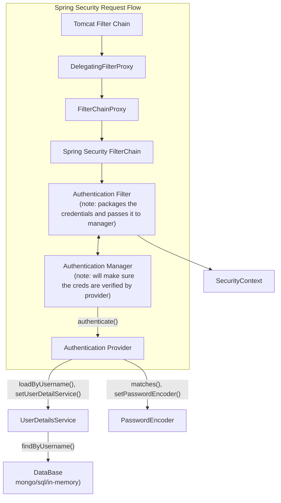

## Spring Security POC
This uses JWT auth with Spring Boot

This POC was created with help from Youtibe Video ( https://www.youtube.com/@rytis-codes )
- https://www.youtube.com/watch?v=ac12zNR-OsE&list=PLVuqGBBX_tP3KmownF68ifFmgPQt-ujBg

## Description
- apis kept in /bruno folder
- excalidraw in /excalidraw folder

## Spring Security Architecture

